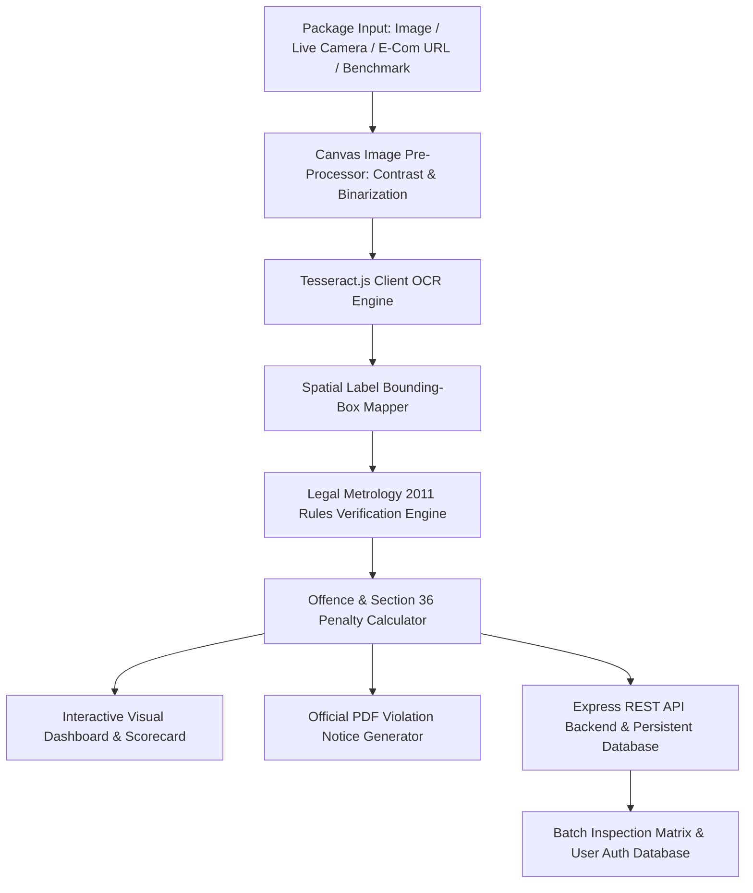

# 🏛️ LM-CompliScan AI 2.0 | Legal Metrology Packaged Commodities Compliance System

[](https://sih.gov.in)
[](https://consumeraffairs.nic.in)
[](https://react.dev)
[](https://vitejs.dev)
[](https://expressjs.com)
[](LICENSE)

> **Software System to check compliance of Packaged Commodities under Legal Metrology (Packaged Commodities) Rules, 2011 by scanning products, images and labels.**  
> *Developed for Smart India Hackathon (Problem ID: SIH26034)*

---

## 📌 Problem Statement Overview

* **Problem Statement ID:** SIH26034
* **Ministry / Department:** Ministry of Consumer Affairs, Food & Public Distribution • Department of Consumer Affairs (Legal Metrology Division)
* **Objective:** Under the **Legal Metrology (Packaged Commodities) Rules, 2011**, all pre-packaged commodities manufactured, packed, or imported in India must bear specific mandatory declarations on their label (e.g., Manufacturer name & address, Net Quantity in metric units, Month & Year of packing, Maximum Retail Price inclusive of all taxes, Consumer Care details, Country of Origin). 
* **Solution:** **LM-CompliScan AI 2.0** is an intelligent, automated inspection software system that uses Optical Character Recognition (OCR), Canvas image pre-processing, spatial bounding-box label extraction, a dedicated Legal Metrology Rules Engine, and a persistent backend database server to instantly detect offences, flag non-standard unit representations (e.g., `gms` vs `g`), enforce missing tax clauses, record inspection audit logs, manage inspector accounts, and generate downloadable statutory **Notice of Violation** PDF reports.

---

## ✨ Key System Features

### 🔐 1. Database & Role Authentication Backend
- **Express REST API Backend (`server/index.js`):** Built-in REST API server listening on `http://localhost:5000` with CORS support and Vite proxy.
- **Persistent Database Engine (`server/db.js` & `server/data/metrology_database.json`):** Atomic persistent database store for user credentials, inspection scan logs, and batch matrix records.
- **Dual User Roles (Official Inspector vs Consumer Advocate):** Dedicated authentication flows for Senior Officers and Public Consumer Advocates, with session tokens stored across sessions and systems.

### 🔍 2. Multi-Input Package Label Scanner
- **File Upload & Drag-and-Drop:** Inspect high-resolution package photos (PNG, JPG, WEBP).
- **Live Webcam Packaging Scanner:** Real-time camera feed capture with bounding box alignment frame.
- **E-Commerce Product Inspector:** Paste product listing URLs or packaging image links from **Amazon India, Flipkart, Blinkit, Zepto, Swiggy Instamart**.
- **Benchmark Sample Suite:** Built-in compliant and non-compliant package label samples (Snack bags, Beverage bottles, Cosmetics, Electronics) for immediate 1-click evaluation.

### 🧠 3. OCR & Spatial Label Bounding-Box Overlay
- **HTML5 Canvas Pre-Processing (`imagePreprocessing.js`):** Adaptive binarization, grayscale conversion, and contrast enhancement to decode low-light or reflective packaging photos.
- **Client OCR Engine (`ocrProcessor.js`):** High-speed `tesseract.js` client integration with spatial bounding-box positioning mapped directly over the uploaded package photo.

### ⚖️ 4. Legal Metrology Rules 2011 Engine
Evaluates mandatory declarations against statutory standards:
* **Rule 6(1)(a) — Manufacturer / Packer / Importer:** Verifies complete Name & Address with 6-digit Pincode.
* **Rule 6(1)(b) — Generic Commodity Name:** Ensures prominent common/generic product name declaration.
* **Rule 6(1)(c) — Net Quantity & Metric Unit Rule:** Enforces mandatory SI metric symbols (`g`, `kg`, `ml`, `l`/`L`, `N` or `U`). **Strictly flags illegal non-standard unit representations** like `gms`, `gm`, `grm`, `kilo`, `ltrs`, `doz`, `pcs`.
* **Rule 6(1)(d) — Date of Mfg / Packing:** Checks presence and format (`MM/YYYY` or `MMM YYYY`).
* **Rule 6(1)(e) — Maximum Retail Price (MRP):** Verifies currency symbol (`₹` / `Rs`) and mandatory clause `(incl. of all taxes)` or `inclusive of all taxes`.
* **Rule 6(1)(f) — Consumer Care Contact:** Validates presence of designated officer/name, full address, phone number, and **mandatory official e-mail ID**.
* **Rule 6(1)(g) — Country of Origin:** Verifies mandatory origin country declaration on all packaged commodities.
* **Rule 6(11) — Unit Sale Price (USP):** Checks unit price rate (e.g. `₹ 0.50 / g` or `₹ 12.00 / N`).

### 🏛️ 5. Dynamic Offence & Penalty Estimator (Legal Metrology Act, 2009)
- Automatically evaluates total violation severity and calculates dynamic fine totals under **Section 36(1) & 36(2) of the Legal Metrology Act, 2009** (First offence: up to ₹25,000 per violation; Second/subsequent offence: up to ₹50,000 per violation or imprisonment).

### 📑 6. Downloadable Official PDF Report Generator
- Instant 1-click download of formal **Legal Metrology Compliance Inspection Certificates & Violation Notices** formatted with Ministry headers, metadata, score breakdown, table matrix, margin wrapping, clean currency formatting, and digital verification block.

### 📊 7. Persistent Batch Audit Matrix & Inspector Analytics
- **Batch Auditor:** Upload multiple package images simultaneously; all scans are saved automatically into the database matrix table.
- **Inspector Analytics Dashboard:** Interactive charts showing top non-compliance rule trends, fine compounding estimators, and category risk heatmaps.
- **Rulebook Explorer:** Searchable Legal Metrology 2011 handbook and minimum font height requirements table (**Rule 7 & 8**).

---

## 📐 System Architecture



---

## 📋 Legal Metrology (Packaged Commodities) Rules 2011 Matrix

| Rule Clause | Mandatory Declaration | Standard Requirement | Common Non-Compliance Flags |
| :--- | :--- | :--- | :--- |
| **Rule 6(1)(a)** | Manufacturer / Importer | Full Name, Address, City, State, 6-Digit PIN | Missing address or PIN code |
| **Rule 6(1)(b)** | Commodity Name | Common or generic name | Missing commodity name |
| **Rule 6(1)(c)** | Net Quantity | SI Metric Units (`g`, `kg`, `ml`, `L`, `N`) | Illegal non-standard units (`gms`, `ltrs`, `pcs`) |
| **Rule 6(1)(d)** | Date of Mfg / Packing | `MM/YYYY` or `MMM YYYY` format | Missing packing month/year |
| **Rule 6(1)(e)** | MRP & Tax Clause | Must state `₹` / `Rs` and `(incl. of all taxes)` | Missing `(incl. of all taxes)` clause |
| **Rule 6(1)(f)** | Consumer Care Details | Contact Person/Address, Phone, **Mandatory Email** | Missing mandatory Email ID |
| **Rule 6(1)(g)** | Country of Origin | Country name declaration | Missing origin country tag |
| **Rule 6(11)** | Unit Sale Price (USP) | Price per g / ml / unit (`₹ 0.50 / g`) | Missing unit sale price rate |

---

## 🛠️ Tech Stack

* **Frontend Framework:** React 18 + Vite 5 (JavaScript)
* **Backend API Server:** Node.js + Express 5 (REST API Server)
* **Database Engine:** Atomic persistent file store (`server/data/metrology_database.json`)
* **Styling & UI:** Custom Glassmorphic Dark & Light UI, Modern CSS Tokens, Google Fonts (*Outfit*, *Inter*, *JetBrains Mono*)
* **Icons & Visuals:** `lucide-react`, Canvas Confetti
* **OCR & Computer Vision:** `tesseract.js`, HTML5 Canvas Image Pre-Processor
* **PDF Report Engine:** `jspdf`

---

## 🚀 Quick Start Guide

### Prerequisites
Make sure you have **Node.js** (v18.0.0 or higher) and **npm** installed on your system.

```bash
node -v
npm -v
```

### Step 1: Clone Repository
```bash
git clone https://github.com/Abhishek-1087/SIH26034_Legal_Metrology_Compliance.git
cd SIH26034_Legal_Metrology_Compliance
```

### Step 2: Install Dependencies
```bash
npm install
```

### Step 3: Start Application & Backend Database Server Concurrently
```bash
npm run dev:all
```

- **Vite Web App:** `http://localhost:3000/`
- **Express Backend API:** `http://localhost:5000/`

---

## ⚙️ Available npm Scripts

| Command | Action |
| :--- | :--- |
| `npm run dev:all` | **(Recommended)** Launches both Frontend Web App (port 3000) and Backend Database Server (port 5000) concurrently. |
| `npm run dev` | Launches frontend Vite dev server only. |
| `npm run server` | Launches Express backend REST API server only. |
| `npm run build` | Compiles production-ready bundle into `/dist`. |
| `npm run preview` | Previews production build locally. |

---

## 📁 Project Directory Structure

```
SIH26034_Legal_Metrology_Compliance/
├── README.md                  # Project documentation & SIH details
├── package.json               # Node dependencies & scripts
├── vite.config.js             # Vite configuration & /api proxy
├── index.html                 # HTML5 template & Google Fonts
├── server/
│   ├── index.js               # Express REST API server routes (Auth & Scans API)
│   ├── db.js                  # Persistent database engine & schema handlers
│   └── data/
│       └── metrology_database.json # Persistent JSON database file
└── src/
    ├── main.jsx               # React DOM entry point
    ├── App.jsx                # Main application wrapper & tab routing
    ├── index.css              # Glassmorphic design system & styling tokens
    ├── engine/
    │   ├── apiService.js              # Client REST API fetch bridge
    │   ├── authService.js             # Authentication & session service
    │   ├── sampleData.js              # Benchmark packaging samples & rule references
    │   ├── imagePreprocessing.js      # Canvas contrast boost & binarization
    │   ├── ocrProcessor.js            # Tesseract.js OCR & bounding box mapper
    │   ├── metrologyRulesEngine.js    # Legal Metrology 2011 compliance parser
    │   └── reportGenerator.js         # Official PDF report generator (jsPDF)
    └── components/
        ├── Navbar.jsx                 # Header bar, theme switcher & auth buttons
        ├── Auth/
        │   └── AuthModal.jsx          # Login & Signup modal (Official vs Consumer roles)
        ├── Scanner/
        │   ├── ImageUploader.jsx      # Drag & drop image uploader
        │   ├── CameraScanner.jsx      # Live webcam stream modal
        │   ├── EcomInspector.jsx      # E-commerce link analyzer modal
        │   └── SampleSelector.jsx     # Preset benchmark test cases selector
        ├── Inspection/
        │   ├── BoundingBoxViewer.jsx  # Interactive label bounding box overlay
        │   ├── ComplianceScoreCard.jsx # Overall status badge, score meter & PDF button
        │   ├── DeclarationGrid.jsx    # Mandatory declarations pass/fail matrix
        │   └── ViolationList.jsx      # Line-by-line offences & Section 36 penalties
        ├── Batch/
        │   └── BatchAuditor.jsx       # Bulk multi-package inspector table (DB persistent)
        ├── Analytics/
        │   └── AnalyticsDashboard.jsx # Inspector trends & fine calculator
        └── Rulebook/
            └── RulebookExplorer.jsx   # Searchable Legal Metrology 2011 guide & font rules
```

---

## 📜 Legal & Statutory References

1. **The Legal Metrology Act, 2009 (No. 1 of 2010)** — Sections 36, 37, 48.
2. **The Legal Metrology (Packaged Commodities) Rules, 2011** — Rules 6, 7, 8, 11 and Schedules.
3. **Legal Metrology (Packaged Commodities) Amendment Rules, 2017 & 2021** — E-Commerce compliance, Unit Sale Price declarations, Country of Origin rules.

---

## 🤝 Authors & Credits

* **Smart India Hackathon (SIH 2024)** — Problem Statement **SIH26034**
* **Ministry of Consumer Affairs, Food & Public Distribution**, Government of India.

---

## 📄 License
This project is open-source and available under the [MIT License](LICENSE).
