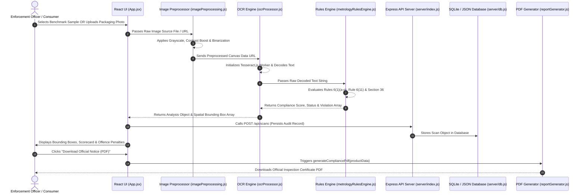

# 💻 Code Working & Architecture Technical Guide
## SIH26034 Legal Metrology Compliance Inspector

---

## 📌 Executive Overview

This document provides a comprehensive technical walkthrough of how **LM-CompliScan AI 2.0** works under the hood, covering the frontend React components, canvas image preprocessor, OCR engine, legal compliance rules parser, PDF generator, Express REST API backend, and persistent database file layer.

---

## 🗂️ Module Directory Breakdown

```
SIH26034_Legal_Metrology_Compliance/
├── server/
│   ├── index.js               # Express REST API Server (Port 5000)
│   ├── db.js                  # Database connection, schemas, and queries
│   └── data/
│       └── metrology_database.json # Persistent JSON Database Store
└── src/
    ├── App.jsx                # Main Application Container & Router
    ├── main.jsx               # React DOM Entry Point
    ├── index.css              # Glassmorphic Theme Engine & CSS Tokens
    ├── engine/
    │   ├── apiService.js              # Client REST API Fetch Service
    │   ├── authService.js             # User Auth & Session Service
    │   ├── sampleData.js              # Benchmark Samples & Rules DB
    │   ├── imagePreprocessing.js      # Canvas Image binarization & contrast boost
    │   ├── ocrProcessor.js            # Tesseract.js OCR & bounding box mapper
    │   ├── metrologyRulesEngine.js    # Legal Metrology 2011 Rules Parser
    │   └── reportGenerator.js         # Official PDF Report Generator (jsPDF)
    └── components/
        ├── Navbar.jsx                 # Header Bar & Theme Switcher
        ├── Auth/AuthModal.jsx         # Login & Signup Modal
        ├── Scanner/
        │   ├── ImageUploader.jsx      # Drag & Drop Image Upload Zone
        │   ├── CameraScanner.jsx      # Live Webcam Modal
        │   ├── EcomInspector.jsx      # E-Commerce Link Inspector Modal
        │   └── SampleSelector.jsx     # Benchmark Sample Selector
        ├── Inspection/
        │   ├── BoundingBoxViewer.jsx  # Interactive Bounding Box Overlay
        │   ├── ComplianceScoreCard.jsx # Overall Status Badge & Score Meter
        │   ├── DeclarationGrid.jsx    # Mandatory Declarations Matrix
        │   └── ViolationList.jsx      # Line-by-Line Offences & Fine Calculator
        ├── Batch/BatchAuditor.jsx     # Persistent Bulk Audit Matrix
        ├── Analytics/AnalyticsDashboard.jsx # Enforcement Analytics & Fine Estimator
        └── Rulebook/RulebookExplorer.jsx   # Searchable Rules Handbook & Font Height Calculator
```

---

## ⚡ Step-by-Step Data Flow Pipeline



---

## 🔬 Core Engine Module Analysis

### 1. Canvas Image Preprocessor (`src/engine/imagePreprocessing.js`)
- **Objective:** Solves real-world photo quality issues (glare, reflections, dim lighting) before text recognition.
- **Algorithm:**
  1. Draws raw image onto an offscreen HTML5 `<canvas>`.
  2. Iterates over raw RGBA pixel data (`ctx.getImageData`).
  3. Computes luminosity: $Y = 0.299R + 0.587G + 0.114B$.
  4. Applies adaptive contrast enhancement ($1.3\times$) and binarization thresholding (pixel cutoff at 128).
  5. Exports high-contrast data URL for Tesseract OCR.

### 2. Tesseract OCR & Bounding Box Mapper (`src/engine/ocrProcessor.js`)
- **Objective:** Extracts text lines and calculates relative percentage coordinates for bounding boxes.
- **Bounding Box Calculation:**
  $$\text{xPercent} = \frac{\text{bbox.x0}}{\text{canvasWidth}} \times 100$$
  $$\text{yPercent} = \frac{\text{bbox.y0}}{\text{canvasHeight}} \times 100$$
- Maps spatial boxes over the packaging photo for interactive hover/click highlighting.

### 3. Legal Metrology Compliance Engine (`src/engine/metrologyRulesEngine.js`)
- **Objective:** Evaluates compliance against Legal Metrology (Packaged Commodities) Rules, 2011.
- **Key Regex & Rules Handled:**
  - **Rule 6(1)(c) Net Quantity Standard Unit:** Validates metric symbols (`g`, `kg`, `ml`, `l`/`L`, `N`, `U`). Flags illegal non-standard units (`gms`, `gm`, `grm`, `kilo`, `ltrs`, `doz`, `pcs`, `milli-litres`).
  - **Rule 6(1)(e) MRP & Tax Clause:** Enforces currency symbol (`₹` / `Rs`) and mandatory string regex `/(?:incl\.?\s*of\s*all\s*taxes|inclusive\s*of\s*all\s*taxes)/i`.
  - **Rule 6(1)(f) Consumer Care Email:** Regex check `/[a-zA-Z0-9._%+-]+@[a-zA-Z0-9.-]+\.[a-zA-Z]{2,}/` for mandatory official complaint email ID.
  - **Section 36 Penalty Calculation:** Computes total offences and estimates first offence (up to ₹25,000 per violation) and repeat offence (up to ₹50,000 per violation) fines.

### 4. Express REST API & Database Layer (`server/index.js` & `server/db.js`)
- **API Server:** Express server running on port `5000` with CORS enabled and Vite proxy forwarding `/api` requests.
- **Endpoints:**
  - `POST /api/auth/register` & `POST /api/auth/login` — Authentication & role management.
  - `GET /api/scans` — Retrieves stored audit records for Batch Inspection Matrix and Analytics Dashboard.
  - `POST /api/scans` & `POST /api/scans/batch` — Persists individual and bulk package inspection logs.
- **Database Engine (`server/db.js`):** File-backed atomic database store (`server/data/metrology_database.json`) pre-seeded with initial benchmark audit data and demo credentials.

### 5. Official PDF Report Generator (`src/engine/reportGenerator.js`)
- **Objective:** Generates formal statutory Notice of Violation PDF reports.
- **Key Features:**
  - Sanitizes Unicode symbols (`₹` -> `Rs.`) to prevent PDF encoding bugs.
  - Uses `doc.splitTextToSize(text, 174)` with `maxWidth: 174mm` to ensure long text lines automatically wrap within page margins.
  - Dynamically calculates callout box heights to enclose all text lines neatly.
