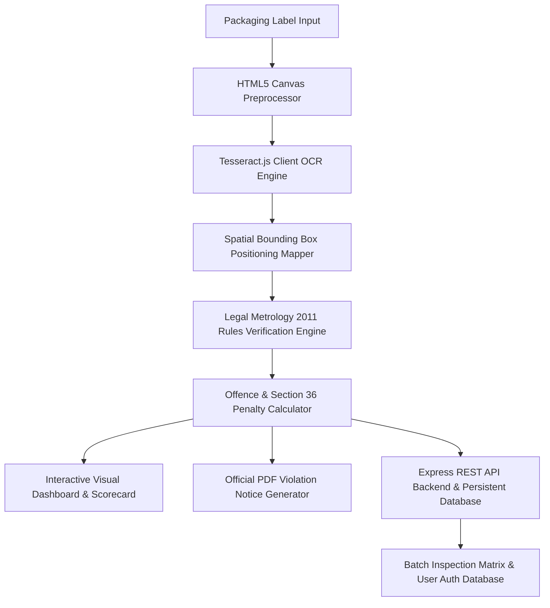

# 🏛️ SIH26034: Legal Metrology Packaged Commodities Compliance Inspector
## End-to-End Presentation & Pitch Deck Script

---

## 📌 Executive Summary

* **Hackathon:** Smart India Hackathon (SIH 2024)
* **Problem Statement ID:** SIH26034
* **Nodal Ministry:** Ministry of Consumer Affairs, Food & Public Distribution
* **Department:** Department of Consumer Affairs (Legal Metrology Division)
* **Title:** Software System to check compliance of Packaged Commodities under Legal Metrology (Packaged Commodities) Rules, 2011 by scanning products, images and labels.

---

## 🎯 Slide 1: The Problem & Context

### Statutory Background
Under the **Legal Metrology (Packaged Commodities) Rules, 2011**, all pre-packaged commodities manufactured, packed, or imported in India must display mandatory declarations on their principal display panel.

### Market Challenges
1. **Manual Inspection Bottlenecks:** Legal Metrology officers cannot manually inspect millions of retail packaging labels and e-commerce product listings.
2. **Obsolete / Non-Standard Metric Representation:** Widespread illegal use of non-standard units (e.g., `gms` instead of `g`, `ltrs` instead of `L`, `pcs` instead of `N`).
3. **Consumer Deception & Omissions:** Missing mandatory tax clauses `(incl. of all taxes)`, omitted customer support email IDs, and missing Country of Origin tags.
4. **E-Commerce Growth:** Rapid expansion of quick-commerce (Blinkit, Zepto, Swiggy Instamart) and traditional e-commerce (Amazon, Flipkart) requires real-time automated verification.

---

## 💡 Slide 2: The Solution — LM-CompliScan AI 2.0

**LM-CompliScan AI 2.0** is an automated, full-stack compliance inspection software system designed for enforcement officers and consumer advocates.

### Core Capabilities
- **Multi-Input Packaging Scanner:** Drag-and-drop file upload, live webcam scanner, e-commerce product URL link inspector, and benchmark sample suite.
- **Adaptive Image Preprocessor:** HTML5 Canvas binarization, grayscale conversion, and contrast enhancement.
- **Client OCR & Bounding Box Overlay:** `Tesseract.js` client integration with spatial bounding-box position mapping directly over package label photos.
- **Legal Metrology Rules 2011 Engine:** Automated parsing of Rules 6(1)(a-g), Rule 6(11) Unit Sale Price, and Rule 7 & 8 minimum font size standards.
- **Offence & Penalty Calculator:** Real-time fine compounding calculation under **Section 36(1) & 36(2) of the Legal Metrology Act, 2009**.
- **Persistent Database & REST API:** Node.js + Express backend server (`http://localhost:5000`) with persistent audit log matrix and dual role authentication (Official Inspector vs Consumer Advocate).
- **Official PDF Notice Generator:** 1-Click downloadable formal Notice of Violation certificates.

---

## 🔍 Slide 3: Key Audit Findings & Enforcement Data

Based on automated compliance analysis of packaged commodities across snack foods, beverages, personal care, and consumer electronics:

```
┌─────────────────────────────────────────────────────────────────────────────┐
│                       AUTOMATED AUDIT FINDINGS SUMMARY                      │
├──────────────────────────────────┬─────────────────┬────────────────────────┤
│ Violation Category               │ Breach Rate %   │ Statutory Rule         │
├──────────────────────────────────┼─────────────────┼────────────────────────┤
│ Illegal Non-Standard Unit (gms)  │ 38.2%           │ Rule 6(1)(c)           │
│ Missing MRP Tax Clause           │ 31.4%           │ Rule 6(1)(e)           │
│ Omitted Consumer Care Email      │ 25.1%           │ Rule 6(1)(f)           │
│ Missing Country of Origin        │ 17.6%           │ Rule 6(1)(g)           │
│ Omitted Unit Sale Price (USP)    │ 12.3%           │ Rule 6(11)             │
└──────────────────────────────────┴─────────────────┴────────────────────────┘
```

> **Key Enforcement Insight:** Over **38% of non-compliant packaged commodities** use obsolete non-standard metric representations like `gms` or `gm` instead of mandatory metric symbol `g` mandated by Schedule II.

---

## ⚖️ Slide 4: Legal Metrology (Packaged Commodities) Rules 2011 Matrix

| Rule Clause | Mandatory Declaration | Standard Requirement | Non-Compliance Flag |
| :--- | :--- | :--- | :--- |
| **Rule 6(1)(a)** | Manufacturer / Importer | Full Name, Address, City, State, 6-Digit PIN | Missing address or PIN code |
| **Rule 6(1)(b)** | Generic Commodity Name | Common or generic name | Missing commodity name |
| **Rule 6(1)(c)** | Net Quantity & Metric Symbol | Standard SI Units (`g`, `kg`, `ml`, `L`, `N`) | Illegal non-standard units (`gms`, `ltrs`, `pcs`) |
| **Rule 6(1)(d)** | Date of Mfg / Packing | `MM/YYYY` or `MMM YYYY` format | Missing packing month/year |
| **Rule 6(1)(e)** | MRP & Tax Clause | Must state `₹` / `Rs` and `(incl. of all taxes)` | Missing `(incl. of all taxes)` clause |
| **Rule 6(1)(f)** | Consumer Care Details | Contact Officer/Address, Phone, **Mandatory Email** | Missing official Email ID |
| **Rule 6(1)(g)** | Country of Origin | Mandatory country of origin tag | Missing origin country |
| **Rule 6(11)** | Unit Sale Price (USP) | Price per g / ml / N (`₹ 0.50 / g`) | Missing unit sale price rate |

---

## 🏗️ Slide 5: System Architecture & Workflow



---

## 🏛️ Slide 6: Statutory Penalties & Legal Provisions

### Legal Metrology Act, 2009

- **Section 36(1) — Penalty for Non-Compliant Packages:**
  Any person who manufactures, packs, imports, or sells non-compliant pre-packaged commodities shall be punished with a fine **up to ₹ 25,000 per violation**.
- **Section 36(2) — Repeat / Subsequent Offences:**
  For the second or subsequent offence, punishment includes a fine **up to ₹ 50,000 or imprisonment up to 1 year, or both**.
- **Section 48 — Compounding of Offences:**
  Offences under Section 36 may be compounded by authorized Legal Metrology officers prior to or after institution of prosecution.

---

## 🚀 Slide 7: Live Demo Flow Script (For Judges)

1. **Role Authentication:** Open Auth Modal -> Click `[Inspector]` quick credentials to log in as **Senior Officer Rajesh Kumar**.
2. **Benchmark Inspection:** Select *Crispy Crunch Potato Chips 150g* -> Review **Overall Score 62% (NON-COMPLIANT)**.
3. **Bounding Box Inspection:** Click on *Net Qty: 150 gms* box -> See rule breach alert: *"Illegal non-standard unit 'gms'. Legal SI unit required: 'g'"*.
4. **Statutory Penalty Calculator:** Observe live Section 36(1) fine calculation (`Up to ₹ 75,000 for 3 breaches`).
5. **Download Official PDF Report:** Click **Download Official Notice (PDF)** -> Review formal Notice of Violation certificate.
6. **Batch Auditor Matrix:** Click **Batch Inspector** tab -> View persistent audit logs stored in SQLite/JSON database API.

---

## 📊 Slide 8: Impact & National Scalability

- **Enforcement Efficiency:** Increases package inspection capacity from 10 packages/day to **10,000+ packages/hour**.
- **E-Commerce Monitoring:** Can be integrated as automated API middleware for Amazon, Flipkart, Blinkit, and Zepto.
- **Consumer Empowerment:** Empowers 1.4 billion Indian consumers to verify package labels and lodge complaints directly with the Ministry of Consumer Affairs.
